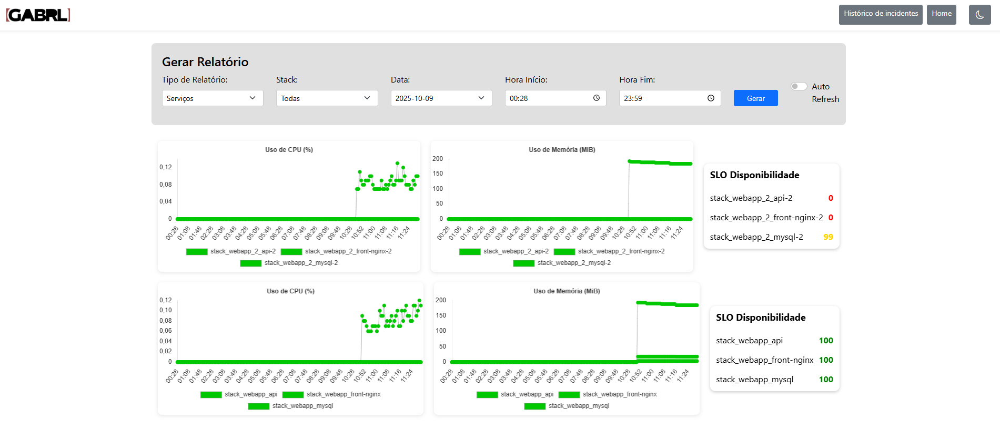

# Monitoramento de Servicos Docker

Este é um aplicativo Python simples para monitorar o status dos servicos Docker Swarm, Filas AWS, Tabelas Banco de Dados. 

Ele exibe os servicos em execucao e seus status, colorindo-os de verde se estiverem em execucao e vermelho se estiverem parados, é possivel tambem ter visualizacao em amarelo para ficar em alerta.

Os alertas sao enviados para as ferramentas Telegram, Teams e Email com base em alteracoes de status entre vermelho-verde.


## Pre-requisitos

* Python 3.x
* Docker instalado e em execucao

## Ambiente

1.  Instale as dependências:

    ```bash
    python3 -m venv venv
    source venv/bin/activate # Linux
    venv/bin/activate # Windows
    pip install --upgrade pip
    pip install --trusted-host pypi.org --trusted-host files.pythonhosted.org --no-cache-dir -r requirements.txt
    ```

2.  Configure o arquivo `.env` com base no env.example:

    * Verifique e ajuste as variáveis de ambiente no arquivo `.env` conforme necessário.

## Execucao

### Execucao Local

1.  Certifique-se de que o Docker esteja em execucao e que esteja com o swarm ativo. 
2.  Exemplo de projeto CRUD para laboratorio: http://github.com/gabrielalpendre/docker_webapp_lab
3.  Execute o aplicativo:

    ```bash
    python app.py
    ```

### Execucao com Docker

1. Set Envs

    ```bash
    export PREFIX=""
    export SERVER_HOSTNAME=$(hostname)
    export SERVER_IP=$(hostname -I | awk '{print $1}')
    ```

2. Substitui as variáveis no docker-compose.yml e sobe os containers

    ```bash
    envsubst < docker-compose.local.yml | docker compose -f - up --build -d
    ```

    Restart:
    ```bash
    envsubst < docker-compose.local.yml | docker compose -f - down && envsubst < docker-compose.local.yml | docker compose -f - up --build -d
    ```

## Utilizacao

### Pagina Home:

Acesse http://localhost:4005/

* **Verde**: Servico em execucao.
* **Vermelho**: Servico parado.


### Pagina Reports:

Acesse http://localhost:4005/reports

* **Services**: Graficos de uso de CPU e Memoria. 



* **Server**: Grafico de Load.


### Pagina Admin: 

Pagina para gerenciamento dos schedules, exclusoes dos servicos a serem monitorados e tambem acompanhamento do tempo medio de execucao.

Acesse http://localhost:4005/admin


### Pagina/Console Logs:

Acesse http://localhost:4005/logs

Ou

Arquivo logs/flask_app.log


## Roadmap

* **render-templates**: Melhoria na utilizacao dos render-templates nas paginas de frontend.
* **export-reports**: Export em csv dos dados selecionados no filtro dos reports. Backend para gerar estes dados.

## Contribuicao

Contribuicões sao bem-vindas! Sinta-se à vontade para abrir issues e pull requests para melhorias e correcões.


## Criador

Gabriel Alpendre 2025 --please copyright--

http://www.linkedin.com/in/gabriel-alpendre/
