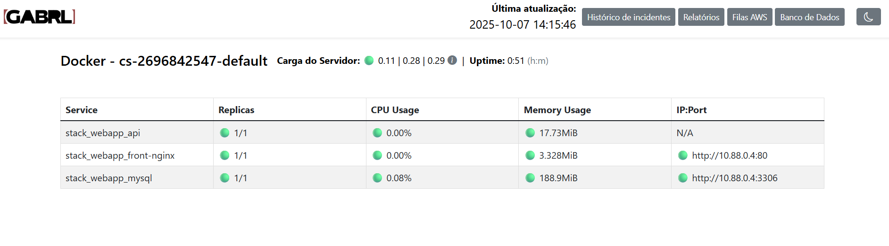
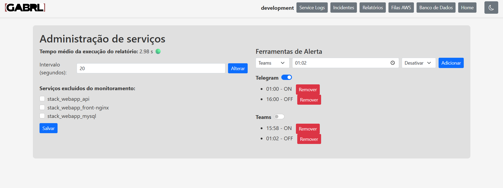

# Monitoramento de Servicos Docker

Este é um aplicativo Python simples para monitorar o status dos servicos Docker. Ele exibe os servicos em execucao e seus status, colorindo-os de verde se estiverem em execucao e vermelho se estiverem parados.

## Pre-requisitos

* Python 3.x
* Docker instalado e em execucao

## Ambiente

1.  Instale as dependências:

    ```bash
    python3 -m venv venv
    source venv/bin/activate # Linux
    venv/bin/activate # Windows
    pip install --upgrade pip
    pip install --trusted-host pypi.org --trusted-host files.pythonhosted.org --no-cache-dir -r requirements.txt
    ```

2.  Configure o arquivo `.env`:

    * Verifique e ajuste as variáveis de ambiente no arquivo `.env` conforme necessário.

## Execucao

### Execucao Local

1.  Certifique-se de que o Docker esteja em execucao.
2.  Execute o aplicativo:

    ```bash
    python app.py
    ```

### Execucao com Docker

1. Set Envs

    ```bash
    export PREFIX=""
    export SERVER_HOSTNAME=$(hostname)
    export SERVER_IP=$(hostname -I | awk '{print $1}')
    ```

2. Substitui as variáveis no docker-compose.yml e sobe os containers

    ```bash
    envsubst < docker-compose.local.yml | docker compose -f - up --build -d
    ```

    Restart:
    ```bash
    envsubst < docker-compose.local.yml | docker compose -f - down && envsubst < docker-compose.local.yml | docker compose -f - up --build -d
    ```

## Utilizacao

Acesse https://localhost:4005/

* **Verde**: Servico em execucao.
* **Vermelho**: Servico parado.





## Contribuicao

Contribuicões sao bem-vindas! Sinta-se à vontade para abrir issues e pull requests para melhorias e correcões.

## Criador

Gabriel Alpendre 2025 --copyright--